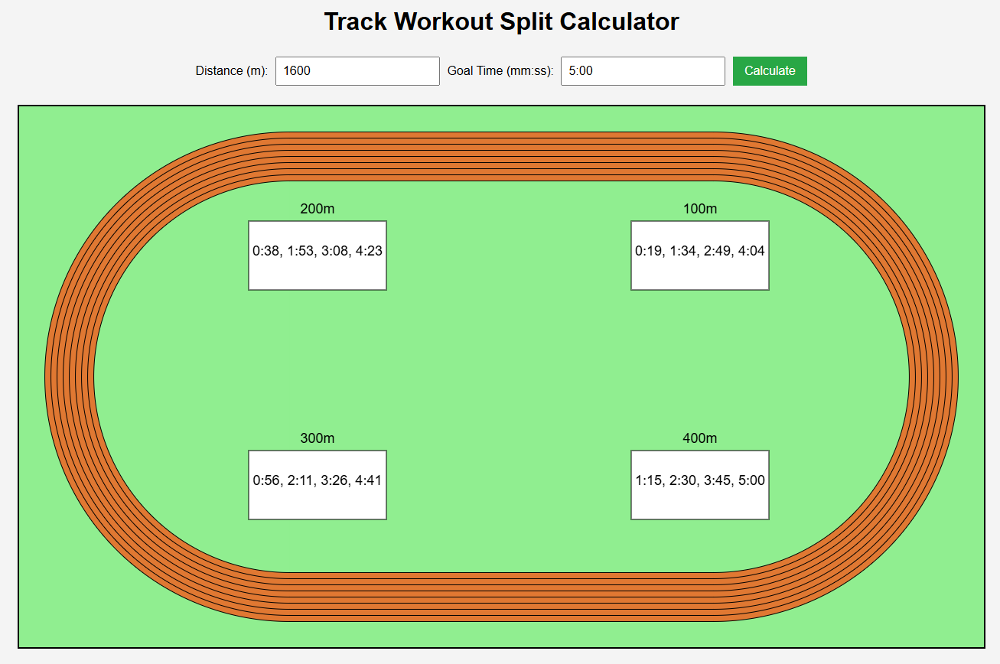

# Track Workout Split Calculator
Enter your desired distance and goal time and receive a graphic with the times you should see at every 100m split of the rep.
## Table of Contents
- Installation
- Usage
- Output
- Contributing
## Installation
1. Clone the repository to your local machine:
   (bash)
   git clone 'https://github.com/bryankeating10/Track-Workout-Split-Calculator'
2. Install dependencies (Ex. Java Script)
## Usage
1. Enter the rep distance (Ex. 1600m) when prompted
2. Enter your goal time for the distance. Acceptable formats are hh:mm:ss or mm:ss
## Output
A graphic of a track will be generated with textboxes at the 100, 200, 300, and 400m locations with their respective splits. Here's an example of an output for an athlete looking to run 1600m in 5 minutes.

## Contributing
1. Fork the repo
2. Creaet a new branch: 'git checkout -b feature-name'
3. Make your changes
4. Push your branch: 'git push origin feature-name'
5. Create a pull request
